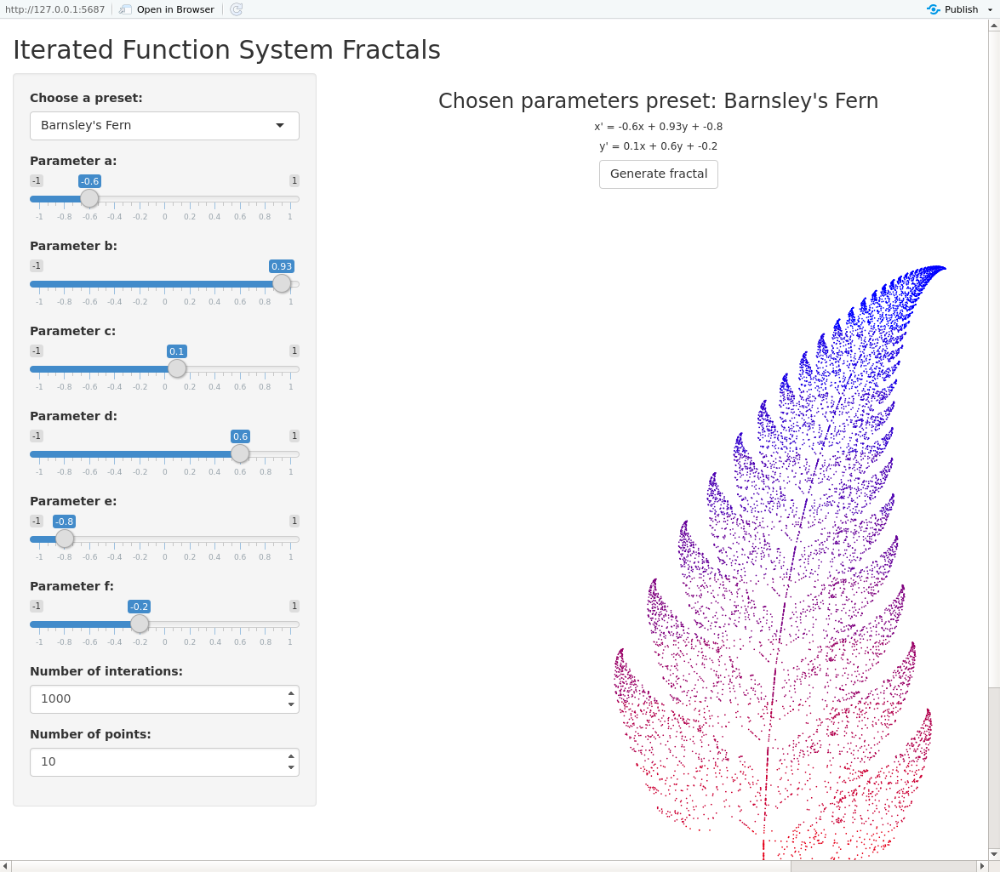
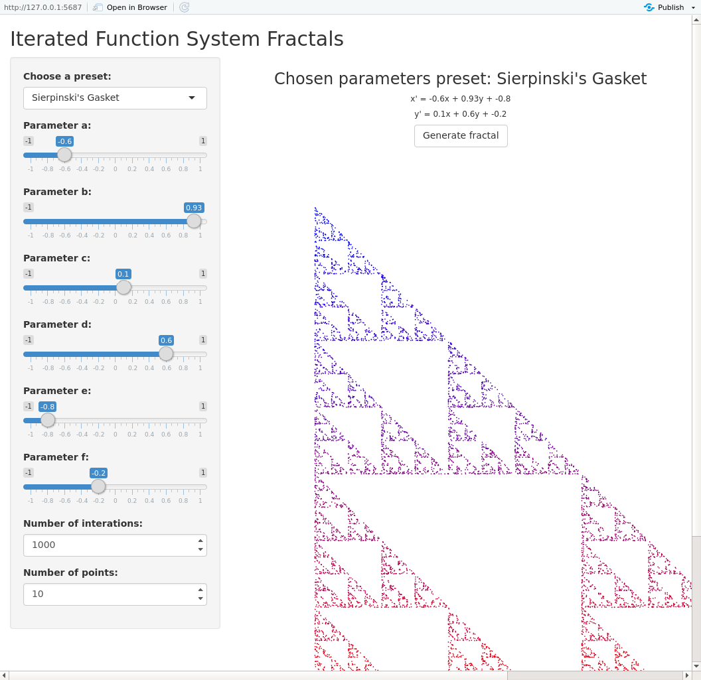

# IFS Fractals Generator

Short university project written with R Shiny to demonstrate how to draw popular fractals.

### How to use

It's best to run this app in RStudio.

Choose on of available functions presets, modify number of initial points and iterations and then click on 'Generate fractal' button.

Alternatively, you can build your own preset by:

0. Clicking on 'Clear functions set' button to erase .csv file with function parameters.
1. Setting the (a, b, c, d, e, f, probability) for each of your custom functions.
2. Adding function to the set by clicking 'Add function to the set' button.
3. Changing preset to 'Custom'.
4. Clicking 'Generate fractal' button.

### Example gallery

#### Barnsley's Fern

#### Sierpinski's Gasket

# TODO!

~~For this 'Custom Preset' to make sense, there should be a structure to which we could add (a,b,c,d,e,f,probability) sets.~~

~~Otherwise, it is quite useless as no interesting fractal can be made with one function :')~~

Everything done.